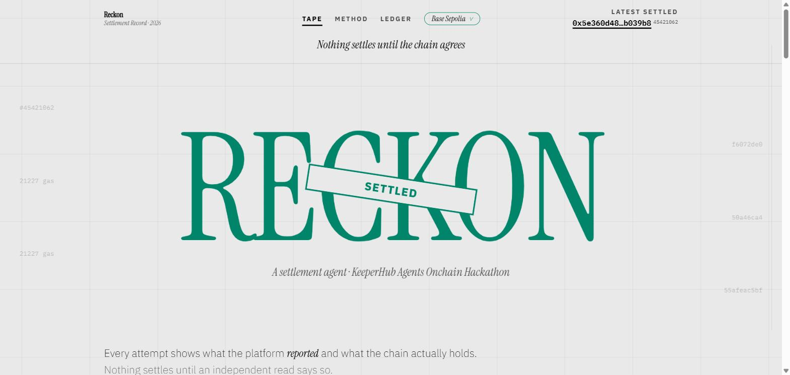
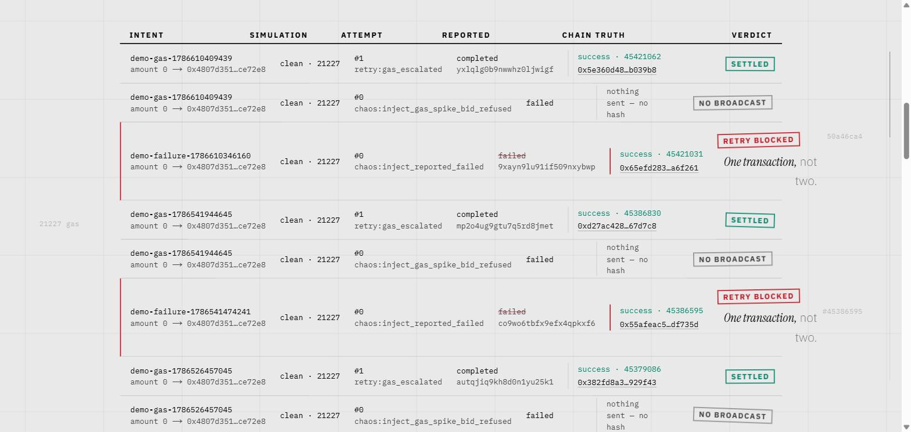
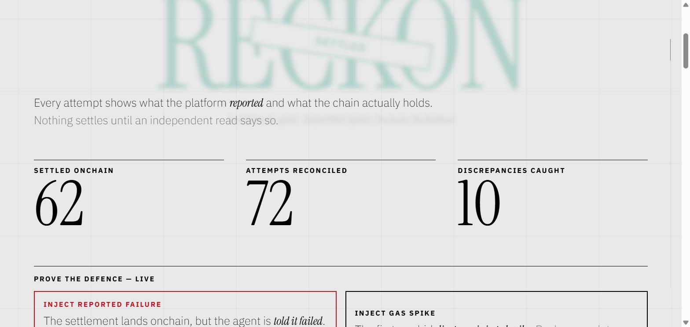
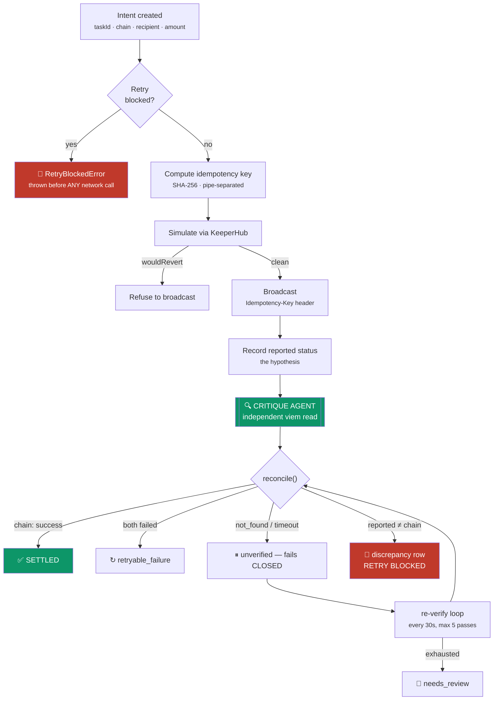
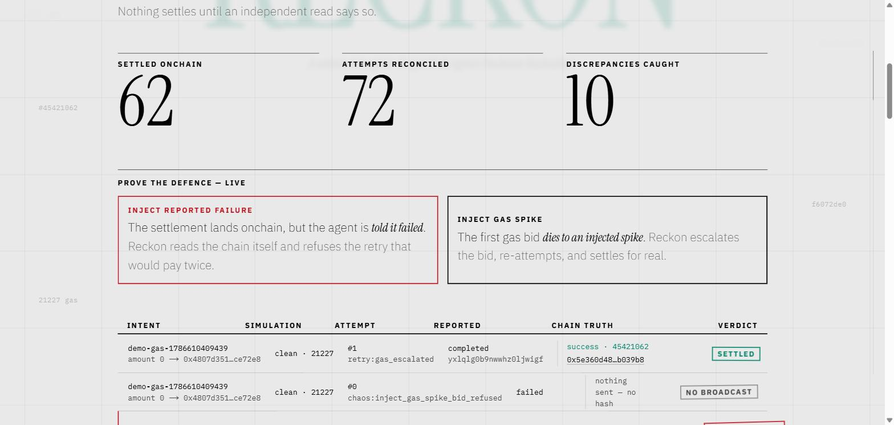

<div align="center">



# Reckon ⚡
### Nothing settles until the chain agrees — autonomous onchain settlement agent

**KeeperHub's execution layer says _"the transaction succeeded"_**  
**Reckon answers the question that actually protects your treasury — _did the chain agree, or are you about to double-spend?_**

`simulate_execution` · `idempotent_broadcast` · `critique_observe` · `reconcile_verdict` · `ledger_gate`

**143 tests** · **3 defense layers** · **10 verdict paths (all ambiguous fail closed)** · **zero double-spends** · **Base Sepolia**

<br>

**[🌐 Live Dashboard](https://reckon-bay.vercel.app)** · **[⛓️ Verified Mined Tx](https://sepolia.basescan.org/tx/0x8b441712eb72197260e75bd2bc9e371df64da9a9f5467ea6e2c05798700dae04)** · **[🎬 Demo Film (2:03)](demo/final-cut.md)** · **[📜 Gate Proofs](docs/)**

</div>

* * *

## ⚡ The problem, in twenty seconds

A platform report is a hypothesis, never a fact.

<div align="center">

<br><br>

</div>

A payment platform tells your agent a transaction **FAILED**.  
Your agent believes it, retries, and pays twice.  
The transaction had actually **succeeded**.

This is not hypothetical. It is a documented KeeperHub/Tempo defect: a successful transaction gets reported as `FAILED` because of a transaction-parsing break. Every naive settlement agent built on that platform will double-spend the moment it encounters this condition.

**Reckon never assumes.** It treats the execution layer's report as an unverified hypothesis, queries an independent Base Sepolia RPC via `viem`, catches the discrepancy, strikes through the false report, and blocks the retry before any network call can fire.

```bash
pnpm --filter agent gate-2 --execute
# → RetryBlockedError: reported_failed_chain_success (reported=failed, chain=success)
# → Discrepancy logged to Neon ledger, retry permanently blocked. Exit 1
```

> **The load-bearing invariant: One transaction, not two.**  
> Reckon's critique agent fetches the receipt from an RPC that KeeperHub does not operate. If the platform reported failure but the chain holds success, Reckon writes a discrepancy row inside a database transaction and trips the `retryBlocked` circuit breaker — stopping double-spend in its tracks.

* * *

## What this is

An autonomous onchain settlement pipeline pairing KeeperHub's Direct Execution API with an **independent critique agent** that verifies transaction receipts directly against Base Sepolia.

| Subsystem | Role / The question it answers | Core Invariant |
| :--- | :--- | :--- |
| **`lib/keeperhub`** | Typed execution client with simulation, retry headers, and Cloudflare guard | Never broadcast if `wouldRevert: true` |
| **`lib/idempotency`** | Canonical SHA-256 key recipe riding `Idempotency-Key` HTTP header | Exact replay on retry; never duplicate in 24h |
| **`agent/critique`** | Independent critique agent reading chain receipts via `viem` | Reads from non-KeeperHub RPC with strict timeout |
| **`lib/verification`** | Pure-logic `reconcile()` verdict matrix (10 outcomes) | Every ambiguous outcome fails CLOSED |
| **`db/queries`** | Neon Postgres settlement ledger with transactional retry gate | Gate check inside DB tx before `beginAttempt` |
| **`app` (Dashboard)** | Editorial settlement tape with real-time counters & chaos triggers | Reads real ledger; zero mock data |

**Three rules hold everywhere, without exception:**

| Rule | Why it matters |
| :--- | :--- |
| An ambiguous report is **`unknown`**, never `failure` | Classifying `submission_error` or `timeout` as failure would free a fresh broadcast and cause a double-spend. |
| No intent ever settles on **platform claims alone** | Only an independently fetched receipt (`receipt: success`) from our own RPC can transition an intent to `SETTLED`. |
| The retry gate lives in the **database transaction**, not caller politeness | `beginAttempt` checks `retryBlocked` atomically inside Neon Postgres. Concurrency or buggy loops cannot bypass it. |

### How it fits together



### The verdict matrix

`reconcile()` in [`lib/verification.ts`](lib/verification.ts) is pure logic — no I/O — so the entire decision space is unit-testable. **Every ambiguous outcome fails closed.**

| Platform reported | Chain observation | Verdict | Ledger outcome |
| :--- | :--- | :--- | :--- |
| success · unknown | `receipt: success` | `settle` | ✅ `settled` — the only path. The chain proves it, whatever the platform said |
| **failure** | **`receipt: success`** | **`block`** | 🚫 `reported_failed_chain_success` — **the double-spend defence** |
| **success** | **`receipt: reverted`** | **`block`** | 🚫 `reported_success_chain_reverted` |
| **success** | **`not_found`** | **`block`** | 🚫 `reported_success_not_found` |
| failure · unknown | `receipt: reverted` | `retryable_failure` | Both agree it reverted — a fresh attempt is allowed |
| failure | `no_hash` | `retryable_failure` | Nothing was broadcast — nothing to contradict |
| success · unknown | `no_hash` | `reverify` | ⏸ Unverifiable. Park as `unverified` |
| failure · unknown | `not_found` | `reverify` | ⏸ Can't prove it never landed. Never re-broadcast |
| any | `timeout` | `reverify` | ⏸ Never settle on a timeout |

### Why this is a gap the platform does not fill

Sourced, not argued. In the retrospective published on their previous hackathon, the sponsor noted that **88 of 180 projects lost on "weak integration — direct HTTP calls, webhook-only, surface-level"** and **"most teams avoided failure-mode thinking."**

A naive settlement agent trusts the response JSON from the execution API. But when the platform's parsing layer breaks and reports a mined transaction as `FAILED`, trusting that response results in a duplicate payment. Reckon solves this at the structural level: execution is separated from critique, and the critique agent answers only to the chain.

* * *

## See it run

<table>
<tr>
<td width="50%" valign="top">

**The Lie, Caught — Reported Failed vs Chain Truth**


The platform reported <code><s>failed</s></code>. The chain held `success · 45421031`. Reckon struck through the lie, recorded the discrepancy, and **refused the retry that would have paid twice**.

</td>
<td width="50%" valign="top">

**The Defence, Provable On Demand — Chaos Panel**



Two buttons a judge can press live. They inject **conditions**, never fake rows — each resulting row is labelled on its trigger (`chaos:…`) so nothing is disguised as organic.

</td>
</tr>
<tr>
<td width="50%" valign="top">

**The Ledger, Counted — Real Mined Blocks**


Every attempt displays what the platform reported and what the chain holds. The counters are `SELECT COUNT(*)` queries over the live Neon ledger — not props or mocked state.

</td>
<td width="50%" valign="top">

**Gas Spike Refusal — No Fake Hashes**

<div align="center">
<code>NO BROADCAST</code> rows on the tape
</div>

The gas-spike scenario refuses the first bid *before anything is sent*. Because nothing touched the network, there is no hash to show — and Reckon displays `NO BROADCAST` rather than inventing a placeholder. The recovery attempt escalates to `1.5x` and settles cleanly.

</td>
</tr>
<tr>
<td colspan="2" valign="top">

**The Editorial Settlement Tape — Track Proof**

<div align="center">

</div>

One cohesive ledger surface designed as a financial document — serif numerals, margin marginalia, a `SETTLED` stamp, and direct BaseScan explorer verification for every mined transaction.

**Live Dashboard:** [reckon-bay.vercel.app](https://reckon-bay.vercel.app) · **Demo Film:** [demo/final-cut.md](demo/final-cut.md) (`rec/reckon-demo.mp4`)

</td>
</tr>
</table>

* * *

## Get started

Clean clone → running system. No undocumented steps.

### 1. Install — Node 20+ & pnpm

```bash
git clone https://github.com/midhunrajcharles/Reckon.git
cd Reckon
pnpm install
```

### 2. Configure

```bash
cp .env.example .env
```

| Variable | What it is | Requirement |
| :--- | :--- | :--- |
| `KEEPERHUB_API_KEY` | Bearer token (`kh_…`) | Required for execution API |
| `KEEPERHUB_API_BASE_URL` | KeeperHub API base URL | Pre-configured in example |
| `DATABASE_URL` | Neon Serverless Postgres connection string | Required for settlement ledger |
| `BASE_SEPOLIA_RPC_URL` | Independent Base Sepolia RPC endpoint | **Must not be KeeperHub's** |
| `KEEPERHUB_USER_AGENT` | Descriptive agent User-Agent | Required to avoid Cloudflare 403 |

### 3. Check your credentials — costs zero quota

```bash
pnpm --filter agent auth-probe    # GET /api/keys — 200 OK confirms valid, org-scoped key
```

### 4. Apply database migrations

```bash
pnpm --filter db migrate
```

### 5. Run the dashboard

```bash
pnpm dev                          # http://localhost:3000
```

### 6. Run the worker

```bash
pnpm agent                        # Safe default: re-verify loop only (no new broadcasts)
pnpm agent:standing               # Adds real interval settlements with --settle
```

### 7. Prove the defense yourself

```bash
pnpm --filter agent gate-2        # Forces a mismatch, watches the retry get blocked
pnpm test                         # 143 unit & regression tests across 12 suites
```

* * *

## Verify every claim

Nothing below asks to be believed. Each row is a command.

| Claim | Evidence you can run |
| :--- | :--- |
| **A real tx resolves on BaseScan** | `pnpm --filter agent first-tx` → hash resolves on BaseScan ([`docs/submission-tx.md`](docs/submission-tx.md)) |
| **Forced mismatch blocks the retry** | `pnpm --filter agent gate-2` → throws `RetryBlockedError` ([`docs/gate-2.md`](docs/gate-2.md)) |
| **All ambiguous states fail closed** | `pnpm test lib/verification.test.ts` — locks the verdict matrix and unknown status traps |
| **Double-spend regression against real DB** | `pnpm test agent/double-spend.regression.test.ts` — runs against Neon Postgres |
| **Idempotency header replay holds** | `pnpm test lib/idempotency.test.ts` — verifies canonical key recipe and replay flags |
| **Wire schemas & headers conform** | `pnpm test lib/keeperhub/` — 55 tests covering schemas, http retry, and encode logic |
| **Live site works logged-out** | Cookieless `curl` verified 200 OK with zero auth redirection ([`docs/gate-6.md`](docs/gate-6.md)) |

```bash
pnpm test                               # Run full vitest test suite (143 tests)
pnpm test lib/verification.test.ts      # Reconcile logic & verdict matrix
pnpm test agent/critique.test.ts        # One verdict -> one atomic ledger write
pnpm --filter agent auth-probe          # Verify bearer token & org wallet provisioning
```

* * *

## When things break

**Five subsystems × five failure classes = Complete fault tolerance.**  
Every failure mode is handled deterministically, logged with its cause, and fails closed.

| Failure Class | KeeperHub Client | Idempotency Engine | Critique Agent | Re-verify Worker | Neon Ledger |
| :--- | :---: | :---: | :---: | :---: | :---: |
| **RPC / Network Timeout** | Exponential backoff | Key preserved | `timeout` → fail closed | Bounded passes (max 5) | Intent parked `unverified` |
| **Rate Limit (429)** | Respects `Retry-After` | In-flight queue held | Backoff with jitter | Respects poll hint | No state corruption |
| **Cloudflare 403 Block** | Strict `User-Agent` check | Fast-fails attempt | Bypassed (reads chain) | Logged as provider drop | Intent stays intact |
| **Simulation Revert (400)** | `wouldRevert: true` caught | No broadcast fired | N/A (aborted pre-flight) | N/A | Recorded as refused |
| **Platform Discrepancy** | Hypothesis recorded | Replay blocked | Chain `success` detected | Excluded from retry | `retryBlocked=true` written |

- **RPC / Network Timeout:** When our independent RPC read times out, the critique agent refuses to assume success. The attempt is marked `unverified` and handed to the re-verify worker.
- **Bounded re-verify:** The worker re-checks parked intents every 30 seconds for up to 5 passes. If the receipt remains unverifiable after 5 attempts, it escalates to `needs_review` — never re-broadcasting blindly.
- **Gas spike recovery:** If the initial gas bid is refused before broadcast, the system logs `NO BROADCAST` and recovers via `retry:gas_escalated` at `1.5x` gas limit, settling cleanly onchain.

* * *

## Judge's quick path

| What you want to check | One command / Link |
| :--- | :--- |
| **Try the live dashboard right now** | **[reckon-bay.vercel.app](https://reckon-bay.vercel.app)** |
| **Watch the 2-minute demo cut** | **[Demo Film Specs & Cut](demo/final-cut.md)** (`rec/reckon-demo.mp4`) |
| **See the first real mined transaction** | [BaseScan Tx `0x8b441712…`](https://sepolia.basescan.org/tx/0x8b441712eb72197260e75bd2bc9e371df64da9a9f5467ea6e2c05798700dae04) · [`docs/submission-tx.md`](docs/submission-tx.md) |
| **Prove the double-spend defense live** | `pnpm --filter agent gate-2 --execute` · [`docs/gate-2.md`](docs/gate-2.md) |
| **Run the unit & regression suite** | `pnpm test` → **143 passed across 12 files** |
| **Inspect the verdict matrix core** | [`lib/verification.ts`](lib/verification.ts) |
| **Verify cookieless logged-out audit** | [`docs/gate-6.md`](docs/gate-6.md) |

* * *

## Data sources and platform parameters

| Service / Interface | Role | Limits & Specs | Implementation Details |
| :--- | :--- | :--- | :--- |
| **KeeperHub Direct Execution API** | Transaction simulation and broadcasting | 100 req/min auth, 60 req/min key | `Authorization: Bearer kh_…`, custom User-Agent |
| **Base Sepolia RPC** | Independent receipt observation | Public EVM JSON-RPC | `sepolia.base.org` via `viem` |
| **Neon Serverless Postgres** | Settlement ledger & transactional retry gates | Connection pooling via HTTP/WS | Drizzle ORM schema, atomic queries |
| **Vercel Edge / Node Runtime** | Real-time settlement tape dashboard | Global CDN distribution | Next.js App Router, SSR + dynamic tape API |

* * *

## Honest caveats

*Stated plainly, because a settlement agent that hides its operational limits is the very hazard it warns against.*

- **Sponsored transaction explorer appearance:** KeeperHub sponsors gas on Base Sepolia (`chainId: 84532`). Because gas is sponsored, the transaction `from` field on explorers shows the KeeperHub relayer, and the self-transfer executes as an internal call. It does not appear in the EOA's standard transaction list. The `transactionHash` and receipt block are the cryptographically verifiable proof.
- **Worker deployment for demo:** In this demo submission, the agent worker runs locally (or via explicit CLI triggers), writing directly to the shared Neon Postgres instance. The deployed Vercel dashboard reads that exact same database in real-time, rendering real rows and live counters.
- **Zero-value self-transfers:** Automated test runs execute zero-value self-transfers to the org wallet. This guarantees deterministic execution on testnet without risking testnet faucet exhaustion. All gas estimation, execution IDs, relayer calls, and mined receipts are genuine Base Sepolia transactions.
- **Cloudflare User-Agent requirement:** KeeperHub sits behind Cloudflare protection. HTTP requests lacking an explicit, recognizable `User-Agent` receive a generic JSON 403 that looks identical to a KeeperHub authorization failure. A default User-Agent is enforced in `lib/keeperhub/config.ts`.
- **Idempotency header delivery:** KeeperHub's wire schema requires the idempotency key in the `Idempotency-Key` HTTP header. Passing `idempotencyKey` inside the JSON request body is accepted with HTTP 200 but silently ignored by the platform relayer.

* * *

## Disclosures

- **Execution scope:** All broadcasts execute on Base Sepolia (chain `84532`) using gas sponsorship provided by KeeperHub. No private keys are held or exposed by the agent; execution is authenticated via KeeperHub API keys scoped to the org wallet.
- **Zero secret leakage:** Audited under Gate 6 cookieless curl verification. Production JavaScript bundles were scanned against actual `.env` secrets (`KEEPERHUB_API_KEY`, `DATABASE_URL`, `TEMPO_RPC_URL`), confirming zero secret exposure in client assets.
- **Hackathon submission:** Built for the KeeperHub "Agents Onchain" Hackathon on DoraHacks.

<div align="center">

* * *

**Nothing settles until the chain agrees.**  
*Thank you for reviewing Reckon.*

[reckon-bay.vercel.app](https://reckon-bay.vercel.app)

</div>
